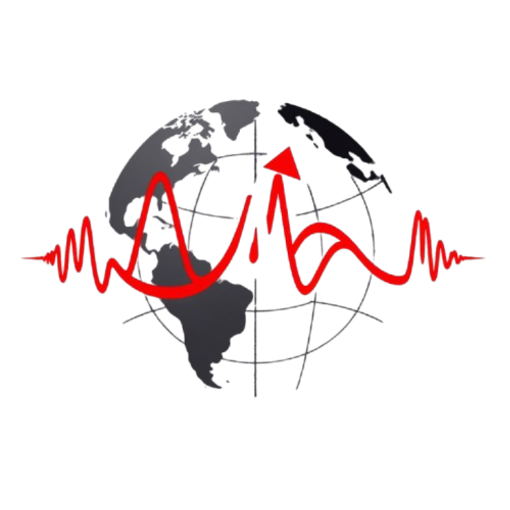

# Seismic Global Information Center 

  

> **Stay Informed, Stay Safe.** A comprehensive and visually appealing information hub to explore global earthquakes in real-time, featuring interactive maps, detailed statistics, relevant news, and essential safety tips.

## 📸 Screenshot

## 🚀 Key Features

*   **🌍 Interactive Earthquake Map:**
    *   Explore a dynamic world map displaying recent earthquakes using the powerful Leaflet library.
    *   **Advanced Filters:** Customize your view with filters for:
        *   **Minimum Magnitude:** Adjust the intensity of earthquakes you wish to visualize with an intuitive slider control.
        *   **Time Period:** Select predefined intervals (Last Hour, Last Day, Last Week, Last Month) to focus your search.
        *   **Map Style:** Choose between different visual map styles (Streets, Satellite, Terrain) to suit your preferences.
    *   **Marker Clustering:** Clear and efficient visualization thanks to marker clustering, ideal for areas with high seismic density.
    *   **Informative Popups:** Click on each marker to get precise earthquake details: location, magnitude, date and time, depth, and a direct link to the USGS source for more information.
    *   **Marker Animations:** Dynamic markers with pulse animation to highlight seismic activity on the map.

*   **📊 Detailed Seismic Statistics:**
    *   Gain a complete overview of recent seismic activity with key statistics panels:
        *   **Total Earthquakes:** Total number of seismic events detected in the selected period.
        *   **Average Magnitude:** Average magnitude of earthquakes, providing a general perspective of intensity.
        *   **Maximum Magnitude:** The strongest earthquake recorded, highlighting the most significant events.
        *   **Earthquakes in the Last 24 Hours:** Specific count of the most recent seismic activity.
    *   **Interactive Charts:** Visualize seismic patterns and trends with dynamic charts created with Chart.js:
        *   **Magnitude Distribution:** Histogram showing the frequency of earthquakes per magnitude range.
        *   **Magnitude Over Time:** Time series graph illustrating magnitude evolution over time.
        *   **Depth Distribution:** Histogram revealing the distribution of seismic focus depths.
        *   **Loading Animations:** Charts with fade-in animation for an engaging visual experience.

*   **📰 Latest Earthquakes & Seismic News Section:**
    *   **Latest Earthquakes List:** Quickly consult an updated list of the most recent earthquakes, with essential information for each event.
    *   **Seismic News (Coming Soon):** Dedicated space to integrate relevant news about seismic events and related topics (feature under development).

*   **⛑️ Safety Tips and Educational Resources:**
    *   **Interactive Safety Guides:** Access essential safety tips organized into key categories: Before, During, and After an earthquake, and the importance of the Emergency Kit. (Detailed content under development).
    *   **Additional Educational Resources:** Direct links to valuable external resources to expand your knowledge and preparedness:
        *   **Educational Videos:** YouTube playlist with informative videos about earthquakes.
        *   **PDF Preparation Guide:** Download the official earthquake preparedness guide from ready.gov.

*   **🌐 Language Selector:**
    *   Navigate the site in your preferred language with a language selector in the navigation bar, with support for: Spanish, English, French, German, Italian, Chinese, and Japanese (Translations in progress).

*   **📱 Responsive Design & Dark Theme:**
    *   **Fully Responsive:** Optimal experience on any device: desktop, tablets, and mobile phones.
    *   **Elegant Dark Theme:** Modern and attractive design with a default dark theme.

*   **✨ CSS Animations:**
    *   Enhanced user experience with subtle and engaging CSS animations in navigation, sections, buttons, charts, and map markers.

## 🛠️ Technologies Used

This project has been built using the following essential technologies and libraries:

*   **Frontend:**
    *   **HTML5:** Structure and content of the webpage.
    *   **CSS3:** Visual styles, responsive design, and animations.
        *   **Tailwind CSS:** Utility-first CSS framework for rapid and consistent development.
        *   **Custom CSS:** Specific styles and animations in `style.css`.
    *   **JavaScript (ES6+):** Interactivity, DOM manipulation, API consumption, and dynamic functionalities.
        *   **Leaflet:** JavaScript library for interactive maps.
        *   **Leaflet.markercluster:** Leaflet plugin for clustering markers.
        *   **Chart.js:** JavaScript library for creating charts.
        *   **Moment.js & Chartjs-adapter-moment:** For date and time management in charts.
        *   **Axios:** HTTP client for making API requests (in the future for real-time data).

*   **External Resources (CDN):**
    *   **Google Fonts (Lato):** Typography.
    *   **Font Awesome, Unicons, Material Icons:** Iconography.
    *   **CDN for JavaScript and CSS libraries:** Facilitates the inclusion of project dependencies.

## 💡 Usage

Navigate through the different sections using the navigation bar:

*   **Home:** Takes you to the main section with an overview and the button to view the map.
*   **Statistics:** Access statistics panels and charts about earthquakes.
*   **News:** Consult the latest seismic news (feature under development).
*   **Tips:** Explore interactive safety guides and links to educational resources.

Interact with the map in the "Earthquake Map" section:

*   **Filter by Magnitude:** Use the slider control to adjust the minimum magnitude.
*   **Change Time Period:** Select a different period in the dropdown menu.
*   **Choose your Map Style:** Select your preferred map style from the dropdown menu.
*   **Click on Markers:** Get detailed information for each earthquake in popups.

## 🙏 Credits and Acknowledgements

This project would not have been possible without the amazing open-source libraries, resources, and communities that have contributed to web development.  We gratefully acknowledge the following:

*   **Open-Source Libraries:**
    *   **Leaflet:**  For providing the fantastic interactive map library that is the heart of our earthquake visualization. We are deeply thankful for the Leaflet community's dedication to creating such a powerful and user-friendly mapping tool. [Link to Leaflet Website](https://leafletjs.com/)
    *   **Leaflet.markercluster:** For the excellent MarkerCluster plugin, which significantly enhances the map's usability by efficiently handling and displaying large numbers of earthquake markers. [Link to Leaflet.markercluster GitHub](https://github.com/Leaflet/Leaflet.markercluster)
    *   **Chart.js:** For the beautiful and versatile Chart.js library that allows us to create informative and visually appealing statistical charts. [Link to Chart.js Website](https://www.chartjs.org/)
    *   **Moment.js and Chartjs-adapter-moment:** For providing the necessary tools to work with dates and times effectively within our charts, making time-based data visualization seamless. [Link to Moment.js Website](https://momentjs.com/) and [Link to Chartjs-adapter-moment GitHub](https://github.com/chartjs/chartjs-adapter-moment)
    *   **Tailwind CSS:** For the utility-first CSS framework that significantly sped up our styling process and allowed us to create a consistent and responsive design efficiently.  [Link to Tailwind CSS Website](https://tailwindcss.com/)
    *   **Axios:** For the promise-based HTTP client that is essential for future integration with earthquake data APIs. [Link to Axios GitHub](https://github.com/axios/axios)

*   **Iconography:**
    *   **Font Awesome:** For the extensive collection of icons that enhance the visual communication and user interface of our website. [Link to Font Awesome Website](https://fontawesome.com/)
    *   **Unicons by Iconscout:** For providing a diverse and stylish set of icons to complement our design. [Link to Unicons Website](https://unicons.iconscout.com/)
    *   **Material Icons:** For the comprehensive set of Material Design icons, offering a consistent and recognizable iconographic language. [Link to Material Icons on Google Fonts](https://fonts.google.com/icons)

*   **Typography:**
    *   **Google Fonts - Lato:** For making the beautiful and readable Lato font freely available, contributing significantly to the website's typography and readability. [Link to Lato Font on Google Fonts](https://fonts.google.com/specimen/Lato)

*   **Data Sources (To be implemented):**
    *   **US Geological Survey (USGS) Earthquake Hazards Program:** We plan to utilize data from the USGS Earthquake Hazards Program API to provide real-time earthquake information. We appreciate their commitment to making earthquake data publicly accessible. [Link to USGS Earthquake Hazards Program Website](https://www.usgs.gov/natural-hazards/earthquake-hazards/earthquakes)  *(Note: Data source integration is planned for future development)*

## 📝 License

This project is distributed under the [MIT License](LICENSE) (If you have chosen an MIT license or another one. Replace and adjust according to your license). See the `LICENSE` file for more details.

## 🧑‍💻 Author

Developed by [fl2on](https://github.com/fl2on/)
